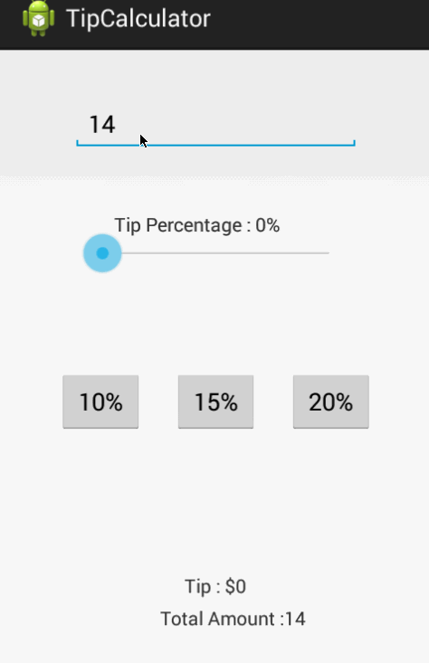

TipCalculator
=============
This is a tip calculator which displays the tip amount and total amount based on the bill amount entered.

1. Total time spent : 4 hrs.

2. Completed User Stories : 
User is displayed the tip of specified percentage for specified entered amount
User enters the total amount of the transaction
User can select between tip amounts (i.e 10%, 15%, 20%)
Upon selecting tip amount, formatted tip value is displayed
(Optional) User changes the total amount and updated tip is reflected automatically
(Optional) User can select custom tip percentage if desired

Walkthrough : 

